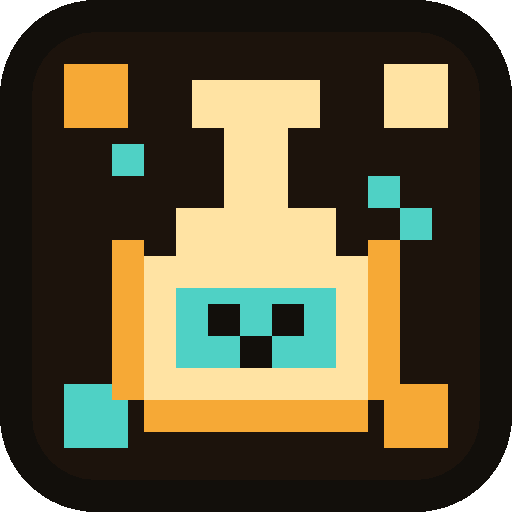

<p align="center">
  
</p>

<h1 align="center">PixLab Desktop</h1>

<p align="center">
  A sharp, local-first pixel-art studio for creators who want clean sprites, fast exports, and zero browser friction.
</p>

<p align="center">
  <a href="./LICENSE"></a>
  
  
  
</p>

<p align="center">
  
</p>

<p align="center">
  <a href="#english">English</a> ·
  <a href="#tieng-viet">Tiếng Việt</a> ·
  <a href="#zh">中文</a>
</p>

<a id="english"></a>

## English

PixLab Desktop packages the PixLab creative toolchain into a native Tauri app. It is built for pixel artists, game developers, and asset teams who need a focused desktop workspace instead of a pile of browser tabs.

### Features

- Image-to-pixel-art conversion with crisp, game-ready output.
- Sprite cleanup tools for transparent backgrounds and tidy edges.
- Spritesheet pipeline with frame slicing, alignment, and preview.
- GIF export for quick animation sharing and iteration.
- Built-in pixel editor for hands-on fixes after conversion.
- Optional Codex-powered spritesheet generation for AI-assisted asset creation.
- Local desktop shell with MIT licensing and GitHub release automation.

### Run

Requirements: Node.js 20+, Rust stable, npm, and the platform SDK for your OS.

```bash
npm ci
npm run dev
```

### Build

```bash
npm run build:mac      # macOS .app and .dmg, run on macOS
npm run build:windows  # Windows installer, run on Windows
```

Prebuilt macOS and Windows packages are available from this repository's Releases page when published.

<a id="tieng-viet"></a>

## Tiếng Việt

PixLab Desktop đưa toàn bộ trải nghiệm PixLab vào một ứng dụng Tauri native: nhanh, gọn, đẹp và sinh ra để làm asset pixel art nghiêm túc.

### Tính năng

- Chuyển ảnh thành pixel art sắc nét, sẵn sàng dùng trong game.
- Làm sạch sprite, xử lý nền trong suốt và viền rác.
- Cắt spritesheet, căn frame, xem trước chuyển động.
- Xuất GIF để kiểm tra animation và chia sẻ nhanh.
- Pixel editor tích hợp để chỉnh tay sau khi convert.
- Tùy chọn tạo spritesheet bằng Codex cho quá trình làm asset bằng AI.
- Mã nguồn MIT, hướng tới trải nghiệm macOS và Windows.

### Chạy dự án

Cần có Node.js 20+, Rust stable, npm và SDK/build tools của hệ điều hành.

```bash
npm ci
npm run dev
```

### Build release

```bash
npm run build:mac      # tạo .app và .dmg trên macOS
npm run build:windows  # tạo installer Windows trên Windows
```

Bản cài đặt macOS và Windows sẽ nằm trong mục Releases của repo khi phát hành.

<a id="zh"></a>

## 中文

PixLab Desktop 将 PixLab 的创作流程打包成原生 Tauri 桌面应用，面向像素艺术、游戏素材和快速动画迭代。

### 功能

- 将图片转换为清晰的游戏级像素艺术。
- 清理 sprite、透明背景和边缘杂点。
- 支持 spritesheet 切帧、对齐和预览。
- 导出 GIF，方便检查和分享动画。
- 内置像素编辑器，转换后可直接微调。
- 可选 Codex spritesheet 生成，用于 AI 辅助素材创作。
- MIT 开源许可，面向 macOS 和 Windows 桌面体验。

### 运行

需要 Node.js 20+、Rust stable、npm，以及当前系统的构建工具。

```bash
npm ci
npm run dev
```

### 构建

```bash
npm run build:mac      # 在 macOS 上生成 .app 和 .dmg
npm run build:windows  # 在 Windows 上生成安装包
```

发布后，可在本仓库的 Releases 页面下载 macOS 和 Windows 安装包。

<p align="center">
  <a href="https://buymeacoffee.com/Dat1305">
    
  </a>
</p>
